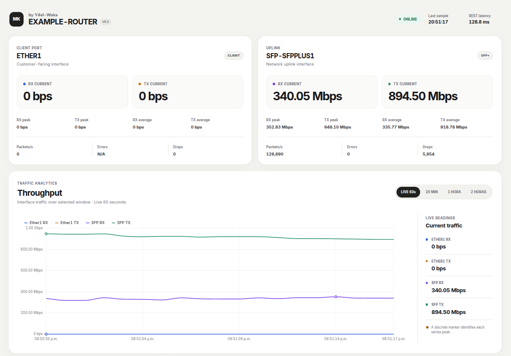
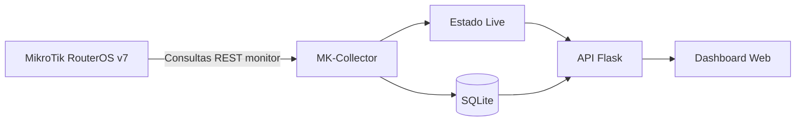
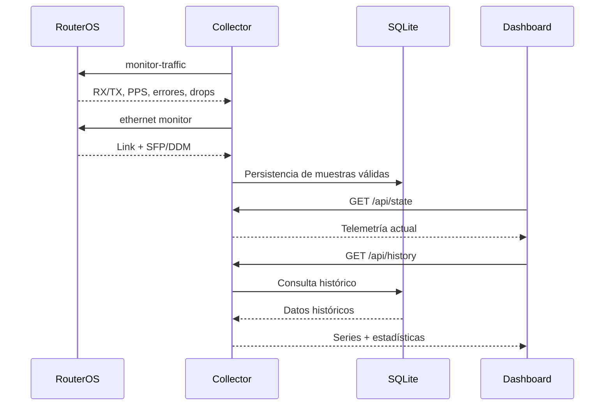
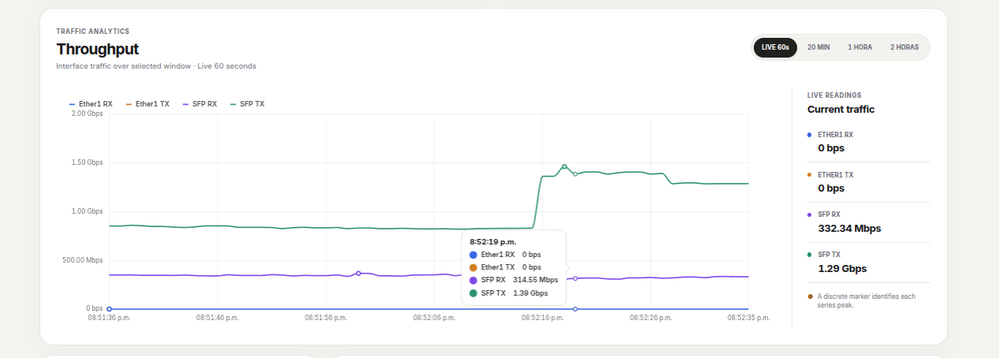
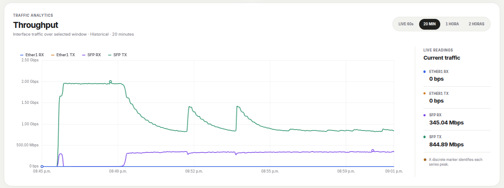
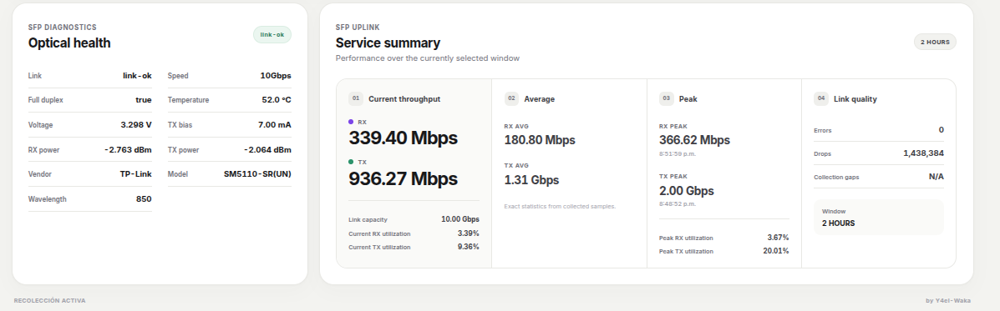

# MK-Collector

[🇺🇸 English](README.md) | **🇲🇽 Español**


Collector ligero de telemetría para **MikroTik RouterOS v7**, enfocado en throughput de interfaces en tiempo real, métricas ópticas SFP/DDM, histórico de corto plazo y un dashboard web moderno.

MK-Collector proporciona una capa de observabilidad enfocada para enlaces y servicios basados en MikroTik, sin intentar sustituir una plataforma NMS completa.

[Changelog](CHANGELOG.md) · [Arquitectura](docs/diagrams/architecture.md) · [Topología](docs/diagrams/topology.md) · [Flujo de datos](docs/diagrams/data-flow.md)



---

## ¿Qué es MK-Collector?

MK-Collector es un servicio desarrollado en Python y Flask que consulta la **API REST de RouterOS**, normaliza telemetría de interfaces, almacena muestras válidas en SQLite y presenta la información mediante un dashboard responsive construido con Chart.js.

La implementación actual permite monitorear:

- Una interfaz física configurable orientada al cliente.
- Una interfaz física configurable de uplink / SFP.
- Throughput RX/TX en tiempo real.
- Tasa de paquetes, errores y drops.
- Salud óptica SFP/DDM.
- Histórico de tráfico de corto plazo.
- Estadísticas current, average, minimum y peak.

Los nombres físicos de las interfaces RouterOS son configurables mediante `.env`, mientras que el contrato interno de API y almacenamiento permanece estable.

Por ejemplo:

```env
CUSTOMER_INTERFACE=ether4
UPLINK_INTERFACE=sfp-sfpplus1
```

puede utilizarse sin modificar frontend, API ni estructura de almacenamiento.

El navegador se comunica únicamente con Flask. La comunicación con RouterOS permanece completamente del lado del backend.

---

## Por qué existe

MK-Collector fue desarrollado para escenarios donde no se requiere desplegar un NMS completo, pero sí se necesita visibilidad inmediata sobre:

- throughput de un servicio,
- puertos de entrega,
- utilización del uplink,
- estado óptico,
- comportamiento reciente del tráfico,
- y picos o anomalías de corto plazo.

El proyecto ha sido validado tanto en **laboratorio** como sobre **servicios reales en producción** utilizando hardware MikroTik RouterOS.

---

## Funciones principales

- Recolección RX/TX prácticamente en tiempo real.
- Interfaces físicas RouterOS configurables.
- Telemetría SFP/DDM.
- Estadísticas current, average, minimum y peak.
- Persistencia de corto plazo en SQLite.
- Ventanas live e históricas.
- Downsampling histórico con preservación de picos.
- Manejo de gaps sin introducir muestras artificiales en cero.
- Recuperación automática después de fallos temporales de RouterOS.
- Dashboard responsive.
- Chart.js servido localmente.
- Allowlist estricta de endpoints RouterOS de solo lectura.
- Compatibilidad con despliegues remotos mediante WireGuard.
- Sin dependencia de SNMP.

---

## Arquitectura



Documentación adicional:

- [Arquitectura](docs/diagrams/architecture.md)
- [Componentes de la aplicación](docs/diagrams/components.md)
- [Topología de despliegue](docs/diagrams/topology.md)
- [Flujo de telemetría](docs/diagrams/data-flow.md)

---

## Topología recomendada

MK-Collector puede ejecutarse sobre cualquier host Linux o compatible con Python que tenga conectividad IP hacia RouterOS.

Para despliegues remotos, WireGuard permite mantener el tráfico de administración fuera de Internet público.

```text
Navegador
    │
    ▼
Host MK-Collector
    │
    │ WireGuard / red privada de administración
    ▼
MikroTik RouterOS
    │
    ├── Interfaz de cliente
    └── SFP / uplink
```

WireGuard funciona únicamente como transporte. MK-Collector no crea ni administra el túnel.

---

## Cómo funciona

1. `config.py` carga la configuración de ejecución desde `.env`.
2. `app.py` inicializa la aplicación y la base SQLite.
3. Workers independientes recolectan tráfico y datos SFP/DDM.
4. El worker de tráfico utiliza `interface/monitor-traffic`.
5. Las interfaces físicas RouterOS se mapean a claves internas estables.
6. El worker DDM utiliza `interface/ethernet/monitor`.
7. Las muestras válidas actualizan el estado live y se almacenan en SQLite.
8. Los fallos de recolección generan gaps en lugar de muestras falsas en cero.
9. El dashboard obtiene el estado actual mediante `/api/state`.
10. Las ventanas históricas se obtienen desde `/api/history`.



---

## Métricas recolectadas

### Tráfico de interfaces

| Categoría | Campos RouterOS |
| --- | --- |
| Throughput | `rx-bits-per-second`, `tx-bits-per-second` |
| Tasa de paquetes | `rx-packets-per-second`, `tx-packets-per-second` |
| FastPath | `fp-rx-bits-per-second`, `fp-tx-bits-per-second` |
| Errores | `rx-errors-per-second`, `tx-errors-per-second` |
| Drops | `rx-drops-per-second`, `tx-drops-per-second`, `tx-queue-drops-per-second` |

### SFP / DDM

| Categoría | Valores |
| --- | --- |
| Enlace | Estado, velocidad negociada, full duplex |
| Eléctrico | Temperatura, voltaje de alimentación, corriente TX bias |
| Óptico | Potencia RX, potencia TX |
| Módulo | Fabricante, part number, longitud de onda y metadata disponible |

Los valores no proporcionados por RouterOS se representan como `N/A`.

---

## Ventanas históricas

| Ventana | Fuente | Bucket de respuesta | Estadísticas |
| --- | --- | ---: | --- |
| LIVE 60s | Memoria | Muestras raw | Current, min, max, average |
| 20 MIN | SQLite | 3 segundos | Estadísticas sobre datos raw |
| 1 HOUR | SQLite | 5 segundos | Estadísticas sobre datos raw |
| 2 HOURS | SQLite | 10 segundos | Estadísticas sobre datos raw |

SQLite conserva muestras válidas raw durante **3 horas por defecto**.

Las respuestas históricas aplican downsampling para reducir la cantidad de puntos enviados al frontend, mientras que estadísticas y timestamps de peaks se calculan directamente sobre las filas originales almacenadas.

De esta forma se conservan los picos reales aunque el navegador reciba una serie reducida.

---

## Capturas

### Dashboard principal


### Throughput en vivo



### Histórico de tráfico



### Salud óptica / SFP DDM



---

## Inicio rápido

### Requisitos

- Python 3.10+
- MikroTik RouterOS v7
- Acceso RouterOS REST
- Conectividad hacia la interfaz de administración

Clona el repositorio:

```bash
git clone https://github.com/Y4el-Waka/MK-Collector.git
cd MK-Collector
```

Crea el entorno:

```bash
python3 -m venv .venv
source .venv/bin/activate
pip install -r requirements.txt
```

Crea la configuración de ejecución:

```bash
cp .env.example .env
```

Inicia el collector:

```bash
python app.py
```

Abre:

```text
http://127.0.0.1:5000
```

---

## Configuración

La configuración de ejecución se carga desde `.env`.

| Variable | Requerida | Predeterminado / ejemplo | Propósito |
| --- | :---: | --- | --- |
| `MIKROTIK_URL` | Sí | `http://192.0.2.1` | URL base de RouterOS |
| `MIKROTIK_USER` | Sí | `collector` | Cuenta utilizada por el collector |
| `MIKROTIK_PASS` | Sí | `CHANGE_ME` | Contraseña del usuario RouterOS |
| `CUSTOMER_INTERFACE` | No | `ether1` | Interfaz física orientada al cliente |
| `UPLINK_INTERFACE` | No | `sfp-sfpplus1` | Interfaz física de uplink / DDM |
| `TRAFFIC_INTERVAL` | No | `1` | Intervalo de tráfico en segundos |
| `DDM_INTERVAL` | No | `5` | Intervalo SFP/DDM en segundos |
| `HISTORY_RETENTION_HOURS` | No | `3` | Retención SQLite |
| `ROUTEROS_TIMEOUT` | No | `4` | Timeout REST |
| `DEVICE_NAME` | No | `EXAMPLE-ROUTER` | Identificador mostrado por la aplicación |
| `DATABASE_PATH` | No | `mk_collector.sqlite3` | Ruta de la base SQLite |

Ejemplo:

```env
MIKROTIK_URL=http://10.77.77.1
MIKROTIK_USER=collector
MIKROTIK_PASS=CHANGE_ME

CUSTOMER_INTERFACE=ether1
UPLINK_INTERFACE=sfp-sfpplus1

TRAFFIC_INTERVAL=1
DDM_INTERVAL=5
HISTORY_RETENTION_HOURS=3

DEVICE_NAME=LAB-ROUTER
DATABASE_PATH=mk_collector.sqlite3
```

---

## Modelo de seguridad

MK-Collector está diseñado alrededor de telemetría RouterOS de solo lectura.

- El acceso se realiza mediante una cuenta dedicada del collector.
- El cliente RouterOS permite únicamente:
  - `interface/monitor-traffic`
  - `interface/ethernet/monitor`
- MK-Collector no implementa operaciones para modificar configuración de RouterOS.
- Las credenciales permanecen exclusivamente del lado backend.
- La conectividad de administración puede transportarse mediante WireGuard u otra red privada.
- La instancia Flask de desarrollo escucha únicamente en localhost por defecto.
- Para exposición remota puede utilizarse un reverse proxy autenticado.

---

## Endpoints de API

| Método | Endpoint | Descripción |
| --- | --- | --- |
| `GET` | `/` | Dashboard |
| `GET` | `/api/state` | Telemetría actual, DDM, buffer live y estadísticas |
| `GET` | `/api/history?window=20m` | Histórico de 20 minutos |
| `GET` | `/api/history?window=1h` | Histórico de 1 hora |
| `GET` | `/api/history?window=2h` | Histórico de 2 horas |

Las ventanas históricas no soportadas devuelven HTTP `400`.

---

## Estructura del proyecto

```text
MK-Collector/
├── app.py
├── collector.py
├── config.py
├── database.py
├── requirements.txt
├── .env.example
├── README.md
├── README.es.md
├── CHANGELOG.md
├── LICENSE
│
├── templates/
│   └── dashboard.html
│
├── static/
│   ├── dashboard.css
│   ├── dashboard.js
│   └── vendor/
│       ├── chart.umd.min.js
│       └── CHARTJS-LICENSE.md
│
├── tests/
│   ├── test_app.py
│   ├── test_collector.py
│   ├── test_config.py
│   └── test_database.py
│
└── docs/
    ├── diagrams/
    │   ├── architecture.md
    │   ├── components.md
    │   ├── data-flow.md
    │   └── topology.md
    │
    └── screenshots/
        ├── dashboard-main.png
        ├── live-throughput.png
        ├── historical-view.png
        └── optical-health.png
```

---

## Estado de validación

| Área | Estado |
| --- | --- |
| Implementación | Completa para el alcance actual de v0.2 |
| Pruebas automatizadas | **18 / 18 passing** |
| Validación RouterOS en laboratorio | Aprobada |
| Operación remota mediante WireGuard | Aprobada |
| Telemetría RouterOS REST real | Aprobada |
| Recolección de tráfico | Aprobada |
| Recolección SFP/DDM | Aprobada |
| Persistencia SQLite | Aprobada |
| Ventanas históricas | Aprobadas |
| Validación sobre servicio productivo | **Aprobada** |

MK-Collector ha sido validado contra hardware MikroTik RouterOS real tanto en un entorno controlado de laboratorio como sobre un servicio productivo.

La validación productiva incluyó telemetría real de interfaces, recolección SFP/DDM, conectividad remota, persistencia, visualización histórica y operación del dashboard.

---

## Pruebas

El proyecto utiliza `unittest`, incluido en Python.

```bash
python -m unittest discover -s tests -v
```

Validaciones adicionales:

```bash
python -m compileall -q app.py collector.py config.py database.py tests
node --check static/dashboard.js
```

La suite actual cubre:

- normalización de tráfico,
- conversiones de unidades,
- mapeo configurable de interfaces,
- valores DDM ausentes,
- fallos REST,
- allowlist de endpoints,
- gaps live,
- recuperación de workers,
- persistencia SQLite,
- limpieza por retención,
- estadísticas,
- downsampling con preservación de picos,
- ventanas históricas.

---

## Casos de uso

- Monitoreo en tiempo real de enlaces MikroTik.
- Observación de interfaces de entrega.
- Análisis de utilización de uplinks.
- Monitoreo de salud óptica.
- Troubleshooting de corto plazo.
- Monitoreo remoto mediante redes privadas.
- Validación de servicios durante provisión o diagnóstico.
- Observabilidad ligera cuando un NMS completo no es necesario.
- Base para plataformas mayores de monitoreo.

---

## Limitaciones

- Un equipo RouterOS por proceso.
- Las claves internas permanecen estables mientras que los nombres físicos RouterOS son configurables.
- SQLite está orientado a histórico de corto plazo y no a retención de series de tiempo prolongada.
- Las vistas históricas actuales se enfocan principalmente en tráfico.
- No existe todavía un motor integrado de alertas.
- No hay autenticación multiusuario ni RBAC.
- No existe adapter SNMP.
- La disponibilidad de DDM depende del transceiver instalado y del soporte RouterOS.
- Los valores de errores y drops reflejan las muestras entregadas por RouterOS y no contadores acumulativos.

---

## Roadmap

Posibles evoluciones futuras:

- Soporte para múltiples equipos.
- Monitoreo de múltiples servicios.
- Collectors remotos.
- Almacenamiento de series de tiempo de largo plazo.
- Alertas y endpoints de health.
- Exportación y reportes CSV / JSON / PDF.
- Autenticación y control de acceso por roles.
- Adapter SNMP opcional.
- Integración con plataformas de observabilidad mayores.

---

## Licencia

MK-Collector está disponible bajo la [Licencia MIT](LICENSE).

Chart.js se distribuye en el proyecto bajo su propia licencia MIT en [`static/vendor/CHARTJS-LICENSE.md`](static/vendor/CHARTJS-LICENSE.md).