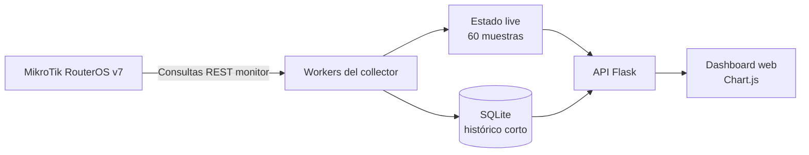

# MK-Collector

[🇺🇸 English](README.md) | **🇲🇽 Español**


Collector ligero de telemetría para MikroTik RouterOS v7, enfocado en throughput de interfaces en tiempo real, métricas ópticas SFP/DDM, histórico corto y un dashboard web moderno.

MK-Collector es un proyecto especializado de observabilidad y una base funcional de laboratorio. No pretende reemplazar un NMS completo como PRTG o The Dude.

[Changelog](CHANGELOG.md) · [Arquitectura](docs/diagrams/architecture.md) · [Topología de despliegue](docs/diagrams/topology.md)

## Contenido

- [¿Qué es MK-Collector?](#qué-es-mk-collector)
- [Por qué existe](#por-qué-existe)
- [Funciones principales](#funciones-principales)
- [Arquitectura](#arquitectura)
- [Topología recomendada](#topología-recomendada)
- [Cómo funciona](#cómo-funciona)
- [Métricas recolectadas](#métricas-recolectadas)
- [Ventanas históricas](#ventanas-históricas)
- [Capturas](#capturas)
- [Inicio rápido](#inicio-rápido)
- [Configuración](#configuración)
- [Modelo de seguridad](#modelo-de-seguridad)
- [Endpoints de API](#endpoints-de-api)
- [Estructura del proyecto](#estructura-del-proyecto)
- [Estado de validación](#estado-de-validación)
- [Pruebas](#pruebas)
- [Casos de uso](#casos-de-uso)
- [Limitaciones](#limitaciones)
- [Roadmap](#roadmap)
- [Licencia](#licencia)

## ¿Qué es MK-Collector?

MK-Collector es un servicio pequeño en Python y Flask que consulta la API REST de RouterOS para dos interfaces, mantiene una vista live de 60 muestras en memoria, guarda muestras válidas en SQLite y expone los datos en un dashboard responsive con Chart.js.

La implementación actual monitorea:

- Una interfaz física de cliente configurable, expuesta internamente mediante la clave compatible `ether1`.
- Una interfaz física de uplink y SFP/DDM configurable, expuesta internamente como `sfp-sfpplus1`.

Los valores físicos predeterminados son `ether1` y `sfp-sfpplus1`. Por ejemplo, `CUSTOMER_INTERFACE=ether4` cambia la consulta RouterOS sin alterar las claves de API, SQLite, estadísticas o frontend.

El navegador se comunica únicamente con Flask. Las credenciales de RouterOS nunca llegan al frontend.

## Por qué existe

El proyecto ofrece una forma enfocada de revisar el throughput de un servicio y la salud óptica sin desplegar una plataforma completa de gestión de red. Es útil en laboratorios controlados, diagnóstico, demostraciones y como base extensible para trabajos de observabilidad más amplios.

## Funciones principales

- Recolección casi en tiempo real de RX/TX con intervalo configurable; un segundo por defecto.
- Consulta SFP/DDM con intervalo configurable; cinco segundos por defecto.
- Estado live, última muestra válida, latencia REST, gaps y recuperación automática ante fallos transitorios.
- Persistencia SQLite de corto plazo con limpieza automática por retención.
- Vistas live e históricas sin recargar la página completa.
- Estadísticas sobre muestras raw y downsampling histórico que conserva picos.
- Dashboard responsive con cuatro series de tráfico activables por separado.
- Allowlist explícita de endpoints monitor; no existen operaciones de escritura.
- Chart.js incluido localmente para operar sin dependencia de Internet.

## Arquitectura



Consulta el [diagrama de arquitectura](docs/diagrams/architecture.md) y el [mapa de componentes](docs/diagrams/components.md).

## Topología recomendada

Ejecuta MK-Collector en un host Linux o compatible con Python. Accede al plano de administración del MikroTik mediante una red privada, preferentemente a través de WireGuard.

```text
Navegador ──localhost── Host collector ──WireGuard── MikroTik RouterOS
```

WireGuard funciona únicamente como transporte: MK-Collector no crea, configura ni administra el túnel. La API REST de RouterOS no debe exponerse directamente a Internet. Consulta la [topología de despliegue](docs/diagrams/topology.md).

## Cómo funciona

1. `config.py` carga la configuración desde `.env`.
2. `app.py` inicializa SQLite y levanta workers separados para tráfico y DDM.
3. El worker de tráfico ejecuta `interface/monitor-traffic` para las interfaces físicas configuradas y las mapea a las claves lógicas `ether1` y `sfp-sfpplus1`.
4. El worker DDM ejecuta `interface/ethernet/monitor` para el uplink físico configurado.
5. Las muestras válidas actualizan el estado en memoria y se guardan en SQLite.
6. Un fallo de tráfico crea un gap en memoria; no se insertan ceros artificiales.
7. El dashboard consulta `/api/state` y solicita ventanas mediante `/api/history`.

RouterOS expone estos comandos monitor mediante solicitudes REST `POST`, aunque las operaciones utilizadas son de solo lectura. Consulta la [secuencia de datos](docs/diagrams/data-flow.md).

## Métricas recolectadas

### Tráfico de interfaces

| Categoría | Campos RouterOS |
| --- | --- |
| Throughput | `rx-bits-per-second`, `tx-bits-per-second` |
| Tasa de paquetes | `rx-packets-per-second`, `tx-packets-per-second` |
| FastPath | `fp-rx-bits-per-second`, `fp-tx-bits-per-second` |
| Errores | `rx-errors-per-second`, `tx-errors-per-second` |
| Drops | `rx-drops-per-second`, `tx-drops-per-second`, `tx-queue-drops-per-second` |

### SFP/DDM

| Categoría | Valores |
| --- | --- |
| Enlace | Estado, velocidad negociada, full duplex |
| Eléctrico | Temperatura, voltaje de alimentación, corriente TX bias |
| Óptico | Potencia RX y potencia TX |
| Identidad | Fabricante, modelo/part number y longitud de onda cuando RouterOS los entrega |

Los campos ausentes permanecen ausentes y se muestran como `N/A`; el collector no inventa valores ópticos.

## Ventanas históricas

| Ventana | Fuente | Bucket de respuesta | Estadísticas |
| --- | --- | ---: | --- |
| LIVE 60s | Buffer en memoria | Muestras raw | Current, min, max, average |
| 20 MIN | SQLite | 3 segundos | Estadísticas sobre datos raw |
| 1 HOUR | SQLite | 5 segundos | Estadísticas sobre datos raw |
| 2 HOURS | SQLite | 10 segundos | Estadísticas sobre datos raw |

SQLite conserva muestras raw válidas durante **3 horas por defecto**. `HISTORY_RETENTION_HOURS` es configurable, con un mínimo de 2. La limpieza se ejecuta aproximadamente cada cinco minutos mientras la recolección está activa.

La respuesta histórica reduce los puntos enviados a la gráfica, pero current/min/max/average y los timestamps de peak se calculan sobre las filas raw. Los picos reales no desaparecen durante el downsampling.

## Capturas

Las capturas se dejan para que el owner las genere en el entorno de laboratorio correcto.

| Vista | Ruta sugerida |
| --- | --- |
| Dashboard principal | `docs/screenshots/dashboard.png` |
| Throughput live | `docs/screenshots/live-throughput.png` |
| Vista histórica | `docs/screenshots/history.png` |
| Vista óptica / DDM | `docs/screenshots/optical-ddm.png` |

<!-- Agrega aquí los enlaces a imágenes cuando existan los archivos. -->

## Inicio rápido

### Requisitos

- Python 3.10 o posterior.
- MikroTik RouterOS v7 con acceso REST habilitado.
- Un usuario dedicado con solamente los permisos necesarios para operaciones monitor.
- Conectividad privada de administración; se recomienda WireGuard.

```bash
git clone <repository-url>
cd MK-Collector
python3 -m venv .venv
source .venv/bin/activate
pip install -r requirements.txt
cp .env.example .env
```

Edita `.env`, inicia el collector y abre el dashboard:

```bash
python app.py
```

[http://127.0.0.1:5000](http://127.0.0.1:5000). El servidor de desarrollo escucha intencionalmente sólo en localhost.

## Configuración

Toda la configuración de ejecución permanece en `.env`.

| Variable | Requerida | Predeterminado / ejemplo | Propósito |
| --- | :---: | --- | --- |
| `MIKROTIK_URL` | Sí | `http://192.0.2.1` | URL base; reemplaza la dirección documental y no agregues `/rest` |
| `MIKROTIK_USER` | Sí | `collector` | Usuario dedicado de RouterOS |
| `MIKROTIK_PASS` | Sí | `CHANGE_ME` | Password; el arranque rechaza un valor vacío |
| `CUSTOMER_INTERFACE` | No | `ether1` | Interfaz física de cliente mapeada a la clave lógica `ether1` |
| `UPLINK_INTERFACE` | No | `sfp-sfpplus1` | Uplink físico usado para tráfico y DDM, mapeado a `sfp-sfpplus1` |
| `TRAFFIC_INTERVAL` | No | `1` | Intervalo de tráfico en segundos |
| `DDM_INTERVAL` | No | `5` | Intervalo SFP/DDM en segundos |
| `HISTORY_RETENTION_HOURS` | No | `3` | Retención SQLite; mínimo 2 |
| `ROUTEROS_TIMEOUT` | No | `4` | Timeout HTTP en segundos |
| `DEVICE_NAME` | No | `EXAMPLE-ROUTER` | Identidad mostrada y guardada |
| `DATABASE_PATH` | No | `mk_collector.sqlite3` junto a la app | Ruta SQLite opcional |

Los valores de `.env.example` son ejemplos documentales seguros. Sustituye `192.0.2.1` por la dirección privada o de administración WireGuard del router y nunca subas el archivo `.env` configurado.

## Modelo de seguridad

- Crea una cuenta dedicada en RouterOS con los permisos mínimos para los dos comandos monitor.
- El cliente acepta únicamente `interface/monitor-traffic` e `interface/ethernet/monitor`.
- Ningún endpoint Flask modifica la configuración del router.
- Las credenciales permanecen en `.env`; no se devuelven por API ni se incluyen en el frontend.
- Restringe `www` o `www-ssl` de RouterOS al host collector o a la subred WireGuard.
- No expongas RouterOS REST directamente a Internet.
- Usa HTTP plano sólo dentro de una red privada confiable o un túnel cifrado. Usa `www-ssl` y validación de certificados cuando necesites TLS extremo a extremo.
- El dashboard no tiene autenticación propia y escucha en `127.0.0.1`; utiliza un reverse proxy autenticado antes de cualquier exposición remota controlada.

Nunca subas `.env`, bases SQLite, capturas de paquetes o exports con credenciales o detalles sensibles.

## Endpoints de API

| Método | Endpoint | Descripción |
| --- | --- | --- |
| `GET` | `/` | HTML del dashboard |
| `GET` | `/api/state` | Estado, últimas métricas, DDM, buffer de 60 muestras y estadísticas live |
| `GET` | `/api/history?window=20m` | Histórico de 20 minutos; buckets de 3 segundos |
| `GET` | `/api/history?window=1h` | Histórico de 1 hora; buckets de 5 segundos |
| `GET` | `/api/history?window=2h` | Histórico de 2 horas; buckets de 10 segundos |

Una ventana no soportada devuelve HTTP `400`. Las respuestas API incluyen `Cache-Control: no-store`.

## Estructura del proyecto

```text
MK-Collector/
├── app.py                     # Rutas Flask y lifecycle
├── collector.py               # Cliente RouterOS, normalización, estado, workers
├── config.py                  # Configuración desde .env
├── database.py                # SQLite, retención, histórico, downsampling
├── requirements.txt
├── templates/dashboard.html
├── static/
│   ├── dashboard.css
│   ├── dashboard.js
│   └── vendor/                # Chart.js y licencia
├── tests/                     # Suite unittest
└── docs/
    ├── diagrams/
    └── screenshots/
```

## Estado de validación

| Área | Estado |
| --- | --- |
| `implementation_complete` | Completa para el alcance v0.2 documentado |
| Pruebas automatizadas | Correctas en la auditoría actual |
| `validated_against_real_routeros` | Validación parcial y controlada con RouterOS v7, reportada por el owner |
| Validación productiva | No completada |

Esta revisión documental no se conectó de forma independiente a un router real y no declara preparación para producción.

## Pruebas

El proyecto utiliza `unittest`, incluido en Python.

```bash
python -m unittest discover -s tests -v
python -m compileall -q app.py collector.py config.py database.py tests
```

La suite cubre normalización, conversiones, faltantes, fallos REST, allowlist read-only, gaps live, recuperación de workers, SQLite, estadísticas, downsampling con preservación de picos y ventanas históricas.

## Casos de uso

- Validar throughput y direccionalidad en un laboratorio controlado.
- Observar un puerto de cliente y su uplink SFP durante pruebas de servicio.
- Revisar salud óptica junto al tráfico sin desplegar un NMS completo.
- Demostrar RouterOS REST, persistencia corta y visualización frontend.
- Servir como base enfocada para una integración de observabilidad mayor.

RouterOS Bandwidth Test puede generar tráfico de laboratorio externamente, pero no forma parte de MK-Collector ni es una dependencia.

## Limitaciones

- Un solo equipo RouterOS por proceso.
- Las claves lógicas de API y almacenamiento permanecen fijas en `ether1` y `sfp-sfpplus1`; los nombres físicos RouterOS se configuran mediante `.env`.
- Histórico SQLite intencionalmente corto; sin backend de series de tiempo a largo plazo.
- Las muestras DDM se guardan, pero la API histórica y las ventanas actuales sólo exponen histórico de tráfico.
- Sin alertamiento, autenticación multiusuario o RBAC.
- Sin adaptador SNMP; la telemetría actual proviene de RouterOS REST.
- Los fallos históricos no se persisten como eventos, por lo que no hay conteo histórico de gaps.
- La disponibilidad DDM depende de la interfaz, el transceiver y RouterOS.
- Errores/drops usan los valores por segundo observados; no son contadores acumulativos.
- Las pruebas productivas de escala y duración siguen pendientes.

## Roadmap

Trabajo futuro posible, no implementado actualmente:

- Adaptador SNMP opcional.
- Interfaces configurables, múltiples equipos y múltiples servicios.
- Collectors remotos y almacenamiento de largo plazo.
- Alertas y endpoint de health.
- Reportes y exportación de datos.
- Autenticación y roles para despliegues compartidos.
- Integración con plataformas de observabilidad mayores.

## Licencia

MK-Collector está disponible bajo la [Licencia MIT](LICENSE).

Chart.js conserva su propia licencia MIT en [`static/vendor/CHARTJS-LICENSE.md`](static/vendor/CHARTJS-LICENSE.md).
