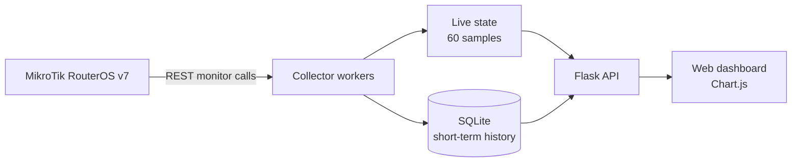

# MK-Collector

**🇺🇸 English** | [🇲🇽 Español](README.es.md)


A lightweight telemetry collector for MikroTik RouterOS v7, focused on real-time interface throughput, SFP/DDM optical metrics, short-term history, and a modern web dashboard.

MK-Collector is a specialized observability project and functional lab foundation. It is not intended to replace a full NMS such as PRTG or The Dude.

[Changelog](CHANGELOG.md) · [Architecture](docs/diagrams/architecture.md) · [Deployment topology](docs/diagrams/topology.md)

## Contents

- [What is MK-Collector?](#what-is-mk-collector)
- [Why it exists](#why-it-exists)
- [Key features](#key-features)
- [Architecture](#architecture)
- [Recommended topology](#recommended-topology)
- [How it works](#how-it-works)
- [Metrics collected](#metrics-collected)
- [Historical windows](#historical-windows)
- [Screenshots](#screenshots)
- [Quick start](#quick-start)
- [Configuration](#configuration)
- [Security model](#security-model)
- [API endpoints](#api-endpoints)
- [Project structure](#project-structure)
- [Validation status](#validation-status)
- [Testing](#testing)
- [Use cases](#use-cases)
- [Limitations](#limitations)
- [Roadmap](#roadmap)
- [License](#license)

## What is MK-Collector?

MK-Collector is a small Python and Flask service that polls the RouterOS REST API for two monitored interfaces, keeps a 60-sample live view in memory, stores valid samples in SQLite, and exposes the data to a responsive Chart.js dashboard.

The current implementation monitors:

- `ether1` as the client-facing interface.
- `sfp-sfpplus1` as the uplink and SFP/DDM source.

The browser communicates only with Flask. RouterOS credentials never reach frontend code.

## Why it exists

The project provides a focused way to inspect service throughput and optical health without deploying a complete network management platform. It is useful for controlled labs, troubleshooting, demonstrations, and as an extensible base for broader observability work.

## Key features

- Near-real-time RX/TX collection at a configurable interval; one second by default.
- SFP/DDM polling at a configurable interval; five seconds by default.
- Live status, last valid sample, REST latency, gaps, and automatic recovery after transient failures.
- Short-term SQLite persistence with automatic retention cleanup.
- Live and historical views without full-page reloads.
- Raw-window statistics and peak-preserving historical downsampling.
- Responsive dashboard with four independently toggleable traffic series.
- Explicit RouterOS monitor-endpoint allowlist; no write or configuration endpoints.
- Locally vendored Chart.js for operation without an Internet dependency.

## Architecture



See the detailed [architecture diagram](docs/diagrams/architecture.md) and [component map](docs/diagrams/components.md).

## Recommended topology

Run MK-Collector on a Linux or Python-capable management host. Reach the MikroTik management plane through a private network, preferably a WireGuard tunnel.

```text
Browser ──localhost── Collector host ──WireGuard── MikroTik RouterOS
```

WireGuard is transport only: MK-Collector does not create, configure, or manage the tunnel. RouterOS REST must not be exposed directly to the public Internet. See the [deployment topology](docs/diagrams/topology.md).

## How it works

1. `config.py` loads configuration from `.env`.
2. `app.py` initializes SQLite and starts separate traffic and DDM workers.
3. The traffic worker calls `interface/monitor-traffic` for both interfaces.
4. The DDM worker calls `interface/ethernet/monitor` for `sfp-sfpplus1`.
5. Valid samples update the in-memory state and are persisted to SQLite.
6. Failed traffic requests create an in-memory gap; they do not insert artificial zeroes.
7. The dashboard polls `/api/state` and requests historical windows from `/api/history`.

RouterOS exposes these monitor commands through REST `POST` requests, but the operations used by MK-Collector are read-only. See the [data-flow sequence](docs/diagrams/data-flow.md).

## Metrics collected

### Interface traffic

| Category | RouterOS fields |
| --- | --- |
| Throughput | `rx-bits-per-second`, `tx-bits-per-second` |
| Packet rate | `rx-packets-per-second`, `tx-packets-per-second` |
| FastPath | `fp-rx-bits-per-second`, `fp-tx-bits-per-second` |
| Errors | `rx-errors-per-second`, `tx-errors-per-second` |
| Drops | `rx-drops-per-second`, `tx-drops-per-second`, `tx-queue-drops-per-second` |

### SFP/DDM

| Category | Values |
| --- | --- |
| Link | Status, negotiated rate, full duplex |
| Electrical | Temperature, supply voltage, TX bias current |
| Optical | RX power and TX power |
| Module identity | Vendor, model/part number, wavelength when supplied by RouterOS |

Missing RouterOS fields remain missing and are displayed as `N/A`; the collector does not invent optical values.

## Historical windows

| Dashboard window | Source | Response bucket | Statistics |
| --- | --- | ---: | --- |
| LIVE 60s | In-memory buffer | Raw samples | Current, min, max, average |
| 20 MIN | SQLite | 3 seconds | Raw-window statistics |
| 1 HOUR | SQLite | 5 seconds | Raw-window statistics |
| 2 HOURS | SQLite | 10 seconds | Raw-window statistics |

SQLite keeps raw valid samples for **3 hours by default**. `HISTORY_RETENTION_HOURS` is configurable but must be at least 2. Cleanup runs approximately every five minutes while collection is active.

Historical responses downsample chart points, while current/min/max/average and peak timestamps are calculated from raw rows. Real peaks are therefore preserved even when fewer points are sent to the browser.

## Screenshots

Screenshots are intentionally left for the repository owner to add from the target lab environment.

| View | Suggested path |
| --- | --- |
| Main dashboard | `docs/screenshots/dashboard.png` |
| Live throughput | `docs/screenshots/live-throughput.png` |
| Historical view | `docs/screenshots/history.png` |
| Optical / DDM view | `docs/screenshots/optical-ddm.png` |

<!-- Add image links here after the corresponding files have been captured. -->

## Quick start

### Requirements

- Python 3.10 or newer.
- MikroTik RouterOS v7 with REST access enabled.
- A dedicated RouterOS user with only the permissions required for monitor operations.
- Private management connectivity; WireGuard is recommended.

```bash
git clone <repository-url>
cd MK-Collector
python3 -m venv .venv
source .venv/bin/activate
pip install -r requirements.txt
cp .env.example .env
```

Edit `.env`, then start the collector:

```bash
python app.py
```

Open [http://127.0.0.1:5000](http://127.0.0.1:5000). The development server intentionally binds to localhost only.

## Configuration

All runtime configuration remains in `.env`.

| Variable | Required | Default / example | Purpose |
| --- | :---: | --- | --- |
| `MIKROTIK_URL` | Yes | `http://192.168.250.2` | RouterOS base URL; no trailing `/rest` |
| `MIKROTIK_USER` | Yes | `collector` | Dedicated RouterOS username |
| `MIKROTIK_PASS` | Yes | `CHANGE_ME` | RouterOS password; startup rejects an empty value |
| `TRAFFIC_INTERVAL` | No | `1` | Traffic polling interval in seconds |
| `DDM_INTERVAL` | No | `5` | SFP/DDM polling interval in seconds |
| `HISTORY_RETENTION_HOURS` | No | `3` | SQLite retention; minimum value is 2 |
| `ROUTEROS_TIMEOUT` | No | `4` | HTTP request timeout in seconds |
| `DEVICE_NAME` | No | `DP-PRUEBAS` | Display and database device identity |
| `DATABASE_PATH` | No | `mk_collector.sqlite3` beside the app | Optional SQLite path override |

The values in `.env.example` are private-network examples only. Do not commit the populated `.env` file.

## Security model

- Create a dedicated RouterOS collector account with only the permissions needed for the two monitor commands.
- The client allowlist accepts only `interface/monitor-traffic` and `interface/ethernet/monitor`.
- No Flask endpoint changes RouterOS configuration.
- Credentials stay in `.env`; they are not returned by the API or embedded in frontend assets.
- Restrict RouterOS `www` or `www-ssl` to the collector host or WireGuard management subnet.
- Do not expose RouterOS REST directly to the Internet.
- Use plain HTTP only inside a trusted private network or encrypted tunnel. Use `www-ssl` and certificate validation when end-to-end TLS is required.
- The dashboard has no application-level authentication and binds to `127.0.0.1`; use an authenticated reverse proxy before controlled remote exposure.

Never commit `.env`, SQLite databases, packet captures, or lab exports containing credentials or infrastructure details.

## API endpoints

| Method | Endpoint | Description |
| --- | --- | --- |
| `GET` | `/` | Dashboard HTML |
| `GET` | `/api/state` | Current status, latest metrics, DDM, 60-sample buffer, and live statistics |
| `GET` | `/api/history?window=20m` | 20-minute history with 3-second buckets |
| `GET` | `/api/history?window=1h` | 1-hour history with 5-second buckets |
| `GET` | `/api/history?window=2h` | 2-hour history with 10-second buckets |

An unsupported history window returns HTTP `400`. API responses use `Cache-Control: no-store`.

## Project structure

```text
MK-Collector/
├── app.py                     # Flask routes and service lifecycle
├── collector.py               # RouterOS client, normalization, state, workers
├── config.py                  # .env-backed settings
├── database.py                # SQLite, retention, history, downsampling
├── requirements.txt
├── templates/dashboard.html
├── static/
│   ├── dashboard.css
│   ├── dashboard.js
│   └── vendor/                # Vendored Chart.js and license
├── tests/                     # Python unittest suite
└── docs/
    ├── diagrams/
    └── screenshots/
```

## Validation status

| Area | Status |
| --- | --- |
| `implementation_complete` | Complete for the documented v0.2 scope |
| Automated tests | Passing in the current repository audit |
| `validated_against_real_routeros` | Partial, controlled RouterOS v7 lab validation reported by the project owner |
| Production validation | Not completed |

This documentation pass did not independently connect to a real router and does not claim production readiness.

## Testing

The project uses Python's built-in `unittest` framework.

```bash
python -m unittest discover -s tests -v
python -m compileall -q app.py collector.py config.py database.py tests
```

The suite covers normalization, conversions, missing values, REST failures, the read-only allowlist, live gaps, worker recovery, SQLite insert/query/cleanup, statistics, peak-preserving downsampling, and history windows.

## Use cases

- Validate throughput and directionality in a controlled network lab.
- Observe a client port and SFP uplink during service tests.
- Check optical health alongside traffic without a full NMS deployment.
- Demonstrate RouterOS REST, short-term persistence, and frontend visualization.
- Use as a focused base for a broader observability integration.

External RouterOS Bandwidth Test may generate laboratory traffic, but it is not part of MK-Collector and the collector does not depend on it.

## Limitations

- One RouterOS target per process.
- Interface names are fixed to `ether1` and `sfp-sfpplus1`.
- SQLite history is intentionally short-term; no long-term time-series backend is included.
- DDM samples are persisted, but the current historical API and dashboard windows expose traffic history only.
- No alerting engine, multi-user authentication, or role-based access control.
- No SNMP adapter; all current device telemetry comes from RouterOS REST.
- Historical failures are not persisted as database events, so historical gap counts are unavailable.
- DDM field availability depends on the interface, transceiver, and RouterOS response.
- Error/drop summaries use observed per-second monitor values; they are not cumulative RouterOS counters.
- Production-scale and long-duration validation remain pending.

## Roadmap

Potential future work, not implemented today:

- Optional SNMP adapter.
- Configurable interfaces, multiple devices, and multiple services.
- Remote collectors and long-term time-series storage.
- Alerts and health-check endpoints.
- Report and data export workflows.
- Authentication and role-based access for shared deployments.
- Integration with larger observability platforms.

## License

MK-Collector is available under the [MIT License](LICENSE).

Chart.js is vendored under its own MIT license in [`static/vendor/CHARTJS-LICENSE.md`](static/vendor/CHARTJS-LICENSE.md).
