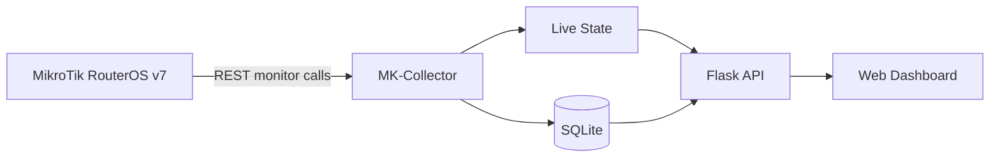
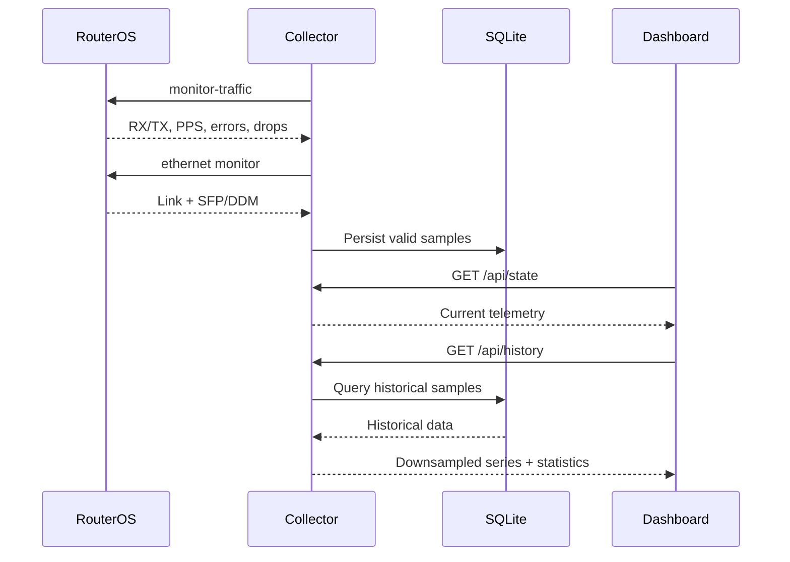

# MK-Collector

**🇺🇸 English** | [🇲🇽 Español](README.es.md)


A lightweight telemetry collector for **MikroTik RouterOS v7**, focused on real-time interface throughput, SFP/DDM optical metrics, short-term history, and a modern web dashboard.

MK-Collector provides a focused observability layer for MikroTik-based service links without attempting to replace a complete NMS platform.

[Changelog](CHANGELOG.md) · [Architecture](docs/diagrams/architecture.md) · [Deployment topology](docs/diagrams/topology.md) · [Data flow](docs/diagrams/data-flow.md)


---

## What is MK-Collector?

MK-Collector is a Python and Flask service that polls the **RouterOS REST API**, normalizes interface telemetry, stores valid samples in SQLite, and exposes the resulting data through a responsive Chart.js dashboard.

The current implementation monitors:

- A configurable physical customer-facing interface.
- A configurable physical uplink / SFP interface.
- Real-time RX/TX throughput.
- Packet rates, errors and drops.
- SFP/DDM optical health.
- Short-term historical traffic.
- Current, average, minimum and peak statistics.

Physical RouterOS interface names are configurable through `.env` while the internal API and storage contract remains stable.

For example:

```env
CUSTOMER_INTERFACE=ether4
UPLINK_INTERFACE=sfp-sfpplus1
```

can be used without changing frontend, API or database keys.

The browser communicates only with Flask. RouterOS communication remains backend-side.

---

## Why it exists

MK-Collector was built for cases where a complete NMS is unnecessary but operators still need immediate visibility into:

- service throughput,
- customer-facing ports,
- uplink utilization,
- optical health,
- short-term traffic behavior,
- and recent peaks or anomalies.

It has been validated in both laboratory and production environments against MikroTik RouterOS devices.

---

## Key features

- Near-real-time RX/TX collection.
- Configurable RouterOS physical interfaces.
- SFP/DDM telemetry.
- Current, average, minimum and peak statistics.
- Short-term SQLite persistence.
- Live and historical chart windows.
- Peak-preserving historical downsampling.
- Collection gap handling without synthetic zero samples.
- Automatic recovery after transient RouterOS failures.
- Responsive web dashboard.
- Local Chart.js dependency.
- Strict read-only RouterOS endpoint allowlist.
- WireGuard-compatible remote deployments.
- No SNMP dependency.

---

## Architecture



Detailed documentation:

- [Architecture](docs/diagrams/architecture.md)
- [Application components](docs/diagrams/components.md)
- [Deployment topology](docs/diagrams/topology.md)
- [Telemetry data flow](docs/diagrams/data-flow.md)

---

## Recommended topology

MK-Collector can run on any Linux or Python-capable management host with IP connectivity to RouterOS.

For remote deployments, WireGuard provides a simple way to keep RouterOS management traffic away from the public Internet.

```text
Browser
   │
   ▼
MK-Collector Host
   │
   │ WireGuard / private management network
   ▼
MikroTik RouterOS
   │
   ├── Customer interface
   └── SFP / uplink
```

WireGuard is transport only. MK-Collector does not create or manage the tunnel itself.

---

## How it works

1. `config.py` loads runtime settings from `.env`.
2. `app.py` initializes the application and SQLite database.
3. Independent workers collect traffic and SFP/DDM data.
4. The traffic worker calls `interface/monitor-traffic`.
5. Physical RouterOS interfaces are mapped to stable internal interface keys.
6. The DDM worker calls `interface/ethernet/monitor`.
7. Valid samples update live state and are persisted to SQLite.
8. Failed traffic requests create gaps instead of artificial zero values.
9. The dashboard reads current data from `/api/state`.
10. Historical windows are retrieved from `/api/history`.



---

## Metrics collected

### Interface traffic

| Category | RouterOS fields |
| --- | --- |
| Throughput | `rx-bits-per-second`, `tx-bits-per-second` |
| Packet rate | `rx-packets-per-second`, `tx-packets-per-second` |
| FastPath | `fp-rx-bits-per-second`, `fp-tx-bits-per-second` |
| Errors | `rx-errors-per-second`, `tx-errors-per-second` |
| Drops | `rx-drops-per-second`, `tx-drops-per-second`, `tx-queue-drops-per-second` |

### SFP / DDM

| Category | Values |
| --- | --- |
| Link | Status, negotiated rate, full duplex |
| Electrical | Temperature, supply voltage, TX bias current |
| Optical | RX power, TX power |
| Module | Vendor, part number, wavelength, module metadata when available |

Missing RouterOS values are represented as `N/A`.

---

## Historical windows

| Dashboard window | Source | Response bucket | Statistics |
| --- | --- | ---: | --- |
| LIVE 60s | Memory | Raw samples | Current, min, max, average |
| 20 MIN | SQLite | 3 seconds | Raw-window statistics |
| 1 HOUR | SQLite | 5 seconds | Raw-window statistics |
| 2 HOURS | SQLite | 10 seconds | Raw-window statistics |

SQLite stores raw valid samples for **3 hours by default**.

Historical chart responses are downsampled for frontend efficiency, while statistics and peak timestamps are calculated from raw database rows.

This preserves real peaks even when the browser receives fewer chart points.

---

## Screenshots

### Main dashboard


### Live throughput


### Historical traffic


### Optical health / SFP DDM


---

## Quick start

### Requirements

- Python 3.10+
- MikroTik RouterOS v7
- RouterOS REST access
- Network reachability to the management interface

Clone the repository:

```bash
git clone https://github.com/Y4el-Waka/MK-Collector.git
cd MK-Collector
```

Create the environment:

```bash
python3 -m venv .venv
source .venv/bin/activate
pip install -r requirements.txt
```

Create the runtime configuration:

```bash
cp .env.example .env
```

Start the collector:

```bash
python app.py
```

Open:

```text
http://127.0.0.1:5000
```

---

## Configuration

Runtime settings are loaded from `.env`.

| Variable | Required | Default / example | Purpose |
| --- | :---: | --- | --- |
| `MIKROTIK_URL` | Yes | `http://192.0.2.1` | RouterOS base URL |
| `MIKROTIK_USER` | Yes | `collector` | RouterOS collector account |
| `MIKROTIK_PASS` | Yes | `CHANGE_ME` | RouterOS account password |
| `CUSTOMER_INTERFACE` | No | `ether1` | Physical customer-facing RouterOS interface |
| `UPLINK_INTERFACE` | No | `sfp-sfpplus1` | Physical uplink / DDM interface |
| `TRAFFIC_INTERVAL` | No | `1` | Traffic polling interval in seconds |
| `DDM_INTERVAL` | No | `5` | SFP/DDM polling interval in seconds |
| `HISTORY_RETENTION_HOURS` | No | `3` | SQLite retention |
| `ROUTEROS_TIMEOUT` | No | `4` | REST request timeout |
| `DEVICE_NAME` | No | `EXAMPLE-ROUTER` | Device label used by the application |
| `DATABASE_PATH` | No | `mk_collector.sqlite3` | SQLite database path |

Example:

```env
MIKROTIK_URL=http://10.77.77.1
MIKROTIK_USER=collector
MIKROTIK_PASS=CHANGE_ME

CUSTOMER_INTERFACE=ether1
UPLINK_INTERFACE=sfp-sfpplus1

TRAFFIC_INTERVAL=1
DDM_INTERVAL=5
HISTORY_RETENTION_HOURS=3

DEVICE_NAME=LAB-ROUTER
DATABASE_PATH=mk_collector.sqlite3
```

---

## Security model

MK-Collector is designed around read-only RouterOS telemetry.

- RouterOS access is performed through a dedicated collector account.
- The RouterOS client allows only:
  - `interface/monitor-traffic`
  - `interface/ethernet/monitor`
- MK-Collector does not expose RouterOS configuration operations.
- RouterOS credentials remain backend-side.
- Management access can be transported through WireGuard or another private management network.
- The Flask development instance binds to localhost by default.
- Remote exposure can be placed behind an authenticated reverse proxy.

---

## API endpoints

| Method | Endpoint | Description |
| --- | --- | --- |
| `GET` | `/` | Dashboard |
| `GET` | `/api/state` | Current telemetry, DDM, live buffer and statistics |
| `GET` | `/api/history?window=20m` | 20-minute history |
| `GET` | `/api/history?window=1h` | 1-hour history |
| `GET` | `/api/history?window=2h` | 2-hour history |

Unsupported historical windows return HTTP `400`.

---

## Project structure

```text
MK-Collector/
├── app.py
├── collector.py
├── config.py
├── database.py
├── requirements.txt
├── .env.example
├── README.md
├── README.es.md
├── CHANGELOG.md
├── LICENSE
│
├── templates/
│   └── dashboard.html
│
├── static/
│   ├── dashboard.css
│   ├── dashboard.js
│   └── vendor/
│       ├── chart.umd.min.js
│       └── CHARTJS-LICENSE.md
│
├── tests/
│   ├── test_app.py
│   ├── test_collector.py
│   ├── test_config.py
│   └── test_database.py
│
└── docs/
    ├── diagrams/
    │   ├── architecture.md
    │   ├── components.md
    │   ├── data-flow.md
    │   └── topology.md
    │
    └── screenshots/
        ├── dashboard-main.png
        ├── live-throughput.png
        ├── historical-view.png
        └── optical-health.png
```

---

## Validation status

| Area | Status |
| --- | --- |
| Implementation | Complete for the current v0.2 scope |
| Automated testing | **18 / 18 passing** |
| RouterOS laboratory validation | Passed |
| WireGuard remote operation | Passed |
| Real RouterOS REST telemetry | Passed |
| Traffic collection | Passed |
| SFP/DDM collection | Passed |
| SQLite persistence | Passed |
| Historical windows | Passed |
| Production deployment validation | **Passed** |

MK-Collector has been validated against real MikroTik RouterOS hardware in both controlled laboratory and production service environments.

Production validation included real interface telemetry, SFP/DDM data collection, remote connectivity, persistence, historical visualization, and dashboard operation.

---

## Testing

The project uses Python's built-in `unittest` framework.

```bash
python -m unittest discover -s tests -v
```

Additional validation:

```bash
python -m compileall -q app.py collector.py config.py database.py tests
node --check static/dashboard.js
```

The test suite covers:

- traffic normalization,
- unit conversion,
- configurable interface mapping,
- missing DDM values,
- REST failures,
- endpoint allowlisting,
- live gaps,
- worker recovery,
- SQLite persistence,
- retention cleanup,
- statistics,
- peak-preserving downsampling,
- historical windows.

---

## Use cases

- Real-time monitoring of MikroTik service links.
- Customer-facing interface observation.
- Uplink utilization analysis.
- Optical health monitoring.
- Short-term troubleshooting.
- Remote monitoring over private management networks.
- Service validation during provisioning or troubleshooting.
- Lightweight observability where a full NMS is unnecessary.
- Building block for larger monitoring platforms.

---

## Limitations

- One RouterOS target per process.
- Internal logical interface keys remain stable while physical RouterOS interface names are configurable.
- SQLite is intended for short-term telemetry rather than long-term time-series retention.
- Historical dashboard views currently focus on traffic telemetry.
- No built-in alerting engine.
- No multi-user authentication or RBAC.
- No SNMP adapter.
- DDM availability depends on the installed transceiver and RouterOS support.
- Error and drop values reflect RouterOS monitor output rather than cumulative counters.

---

## Roadmap

Potential future work:

- Multi-device support.
- Multi-service monitoring.
- Remote collector agents.
- Long-term time-series storage.
- Alerting and health endpoints.
- CSV / JSON / PDF reporting and exports.
- Authentication and role-based access.
- Optional SNMP adapter.
- Integration with larger observability platforms.

---

## License

MK-Collector is available under the [MIT License](LICENSE).

Chart.js is vendored under its own MIT license in [`static/vendor/CHARTJS-LICENSE.md`](static/vendor/CHARTJS-LICENSE.md).