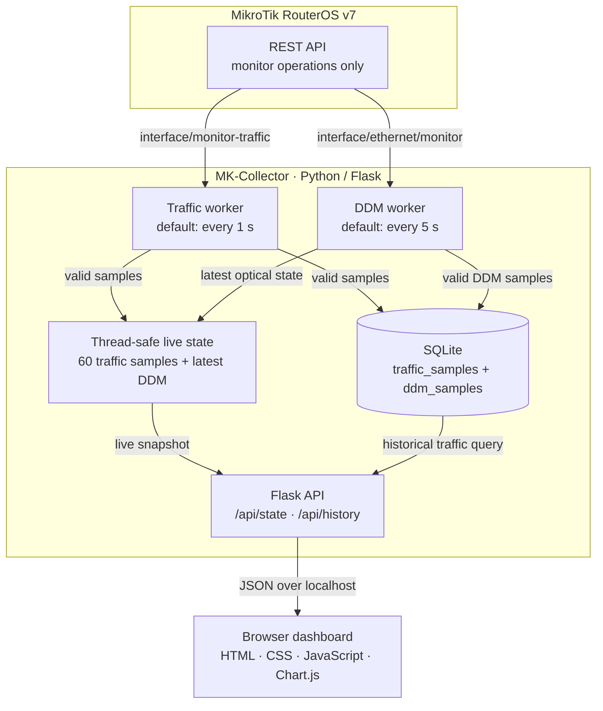

# Architecture

[Back to README](../../README.md)

MK-Collector separates RouterOS access, live state, short-term persistence, the local API, and presentation. Only the collector workers communicate with the router.

## Boundaries

- RouterOS access is limited in code to two monitor endpoints.
- Failed traffic requests create live gaps and do not write artificial zeroes to SQLite.
- SQLite uses one connection per operation instead of sharing a connection between workers.
- The browser never communicates with RouterOS and never receives RouterOS credentials.
- Historical API queries currently return traffic history; persisted DDM samples are not exposed as a historical endpoint.
