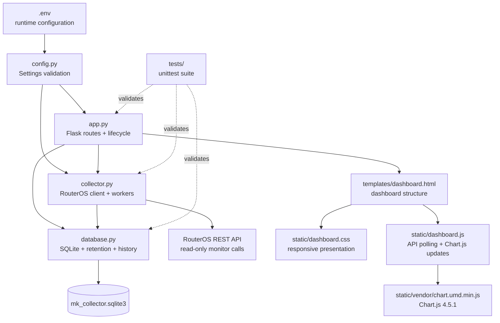

# Component Map

[Back to README](../../README.md)

| Component | Responsibility |
| --- | --- |
| `app.py` | Creates Flask, initializes storage, exposes `/`, `/api/state`, and `/api/history`, and owns service startup/shutdown. |
| `collector.py` | Normalizes RouterOS data, maps configurable physical interfaces to stable logical keys, limits allowed monitor endpoints, maintains thread-safe live state, and runs traffic/DDM workers. |
| `database.py` | Creates the SQLite schema, inserts valid samples, cleans expired rows, calculates raw statistics, and downsamples historical points. |
| `config.py` | Loads `.env`, applies defaults, and validates positive intervals and minimum retention. |
| `templates/dashboard.html` | Defines the dashboard's accessible semantic structure. |
| `static/dashboard.js` | Polls Flask, changes time windows, formats metrics, and updates the existing Chart.js instance. |
| `static/dashboard.css` | Implements the responsive light dashboard presentation. |
| `static/vendor/` | Contains Chart.js 4.5.1 and its upstream MIT license. |
| `tests/` | Exercises application routes, normalization, failure recovery, storage, cleanup, statistics, and downsampling. |

The current boundaries keep future multi-device or long-term storage work possible without claiming those capabilities today.
