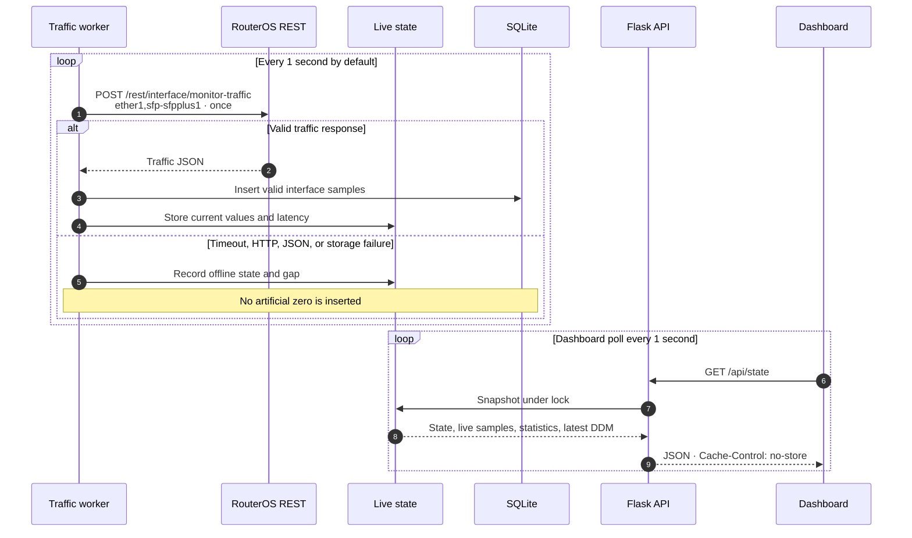
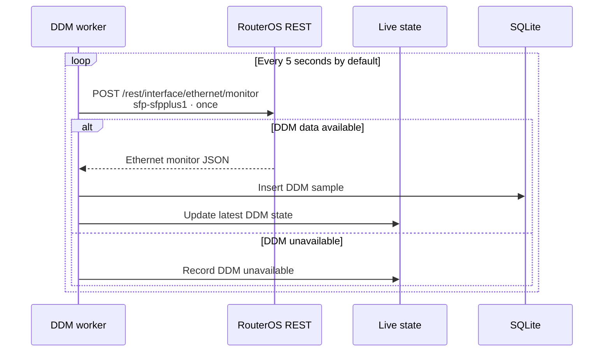
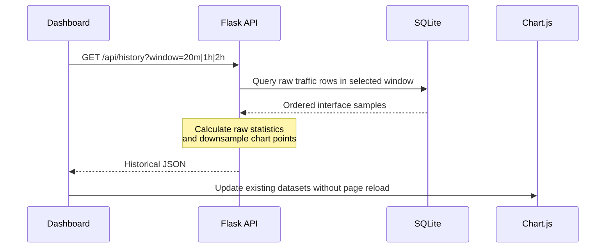

# Data Flow

[Back to README](../../README.md)

The intervals below are defaults and can be changed through `.env`.

## Live collection

```mermaid
sequenceDiagram
    autonumber
    participant T as Traffic worker
    participant R as RouterOS REST
    participant L as Live state
    participant S as SQLite
    participant A as Flask API
    participant D as Dashboard

    loop Every 1 second by default
        T->>R: POST /rest/interface/monitor-traffic<br/>ether1,sfp-sfpplus1 · once
        alt Valid traffic response
            R-->>T: Traffic JSON
            T->>S: Insert valid interface samples
            T->>L: Store current values and latency
        else Timeout, HTTP, JSON, or storage failure
            T->>L: Record offline state and gap
            Note over T,S: No artificial zero is inserted
        end
    end

    loop Dashboard poll every 1 second
        D->>A: GET /api/state
        A->>L: Snapshot under lock
        L-->>A: State, live samples, statistics, latest DDM
        A-->>D: JSON · Cache-Control: no-store
    end
```

## Optical collection

```mermaid
sequenceDiagram
    participant O as DDM worker
    participant R as RouterOS REST
    participant L as Live state
    participant S as SQLite

    loop Every 5 seconds by default
        O->>R: POST /rest/interface/ethernet/monitor<br/>sfp-sfpplus1 · once
        alt DDM data available
            R-->>O: Ethernet monitor JSON
            O->>S: Insert DDM sample
            O->>L: Update latest DDM state
        else DDM unavailable
            O->>L: Record DDM unavailable
        end
    end
```

## Historical request

```mermaid
sequenceDiagram
    participant D as Dashboard
    participant A as Flask API
    participant S as SQLite
    participant C as Chart.js

    D->>A: GET /api/history?window=20m|1h|2h
    A->>S: Query raw traffic rows in selected window
    S-->>A: Ordered interface samples
    Note over A: Calculate raw statistics<br/>and downsample chart points
    A-->>D: Historical JSON
    D->>C: Update existing datasets without page reload
```
