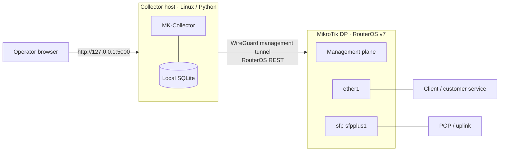

# Recommended Deployment Topology

[Back to README](../../README.md)

## Deployment notes

- WireGuard is the recommended management transport, not a feature managed by MK-Collector.
- Keep RouterOS `www` or `www-ssl` restricted to the collector host or the private WireGuard subnet.
- Do not expose RouterOS REST directly to the public Internet.
- The built-in Flask server listens on `127.0.0.1`. Use an authenticated, TLS-enabled reverse proxy for any controlled remote dashboard access.
- Private examples such as `10.77.77.0/24` or `192.168.250.0/24` are suitable for documentation; deployment addressing remains environment-specific.
